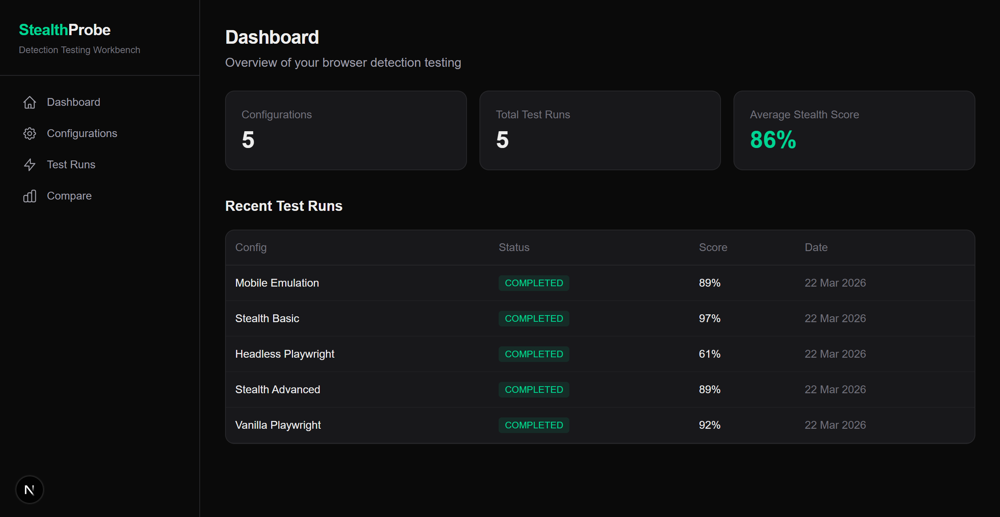
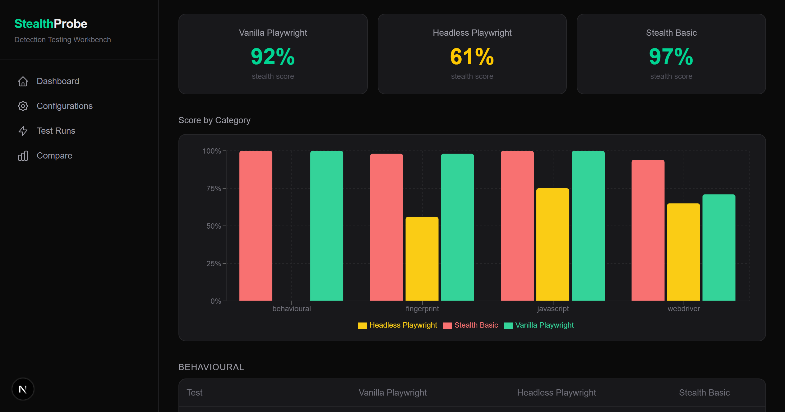
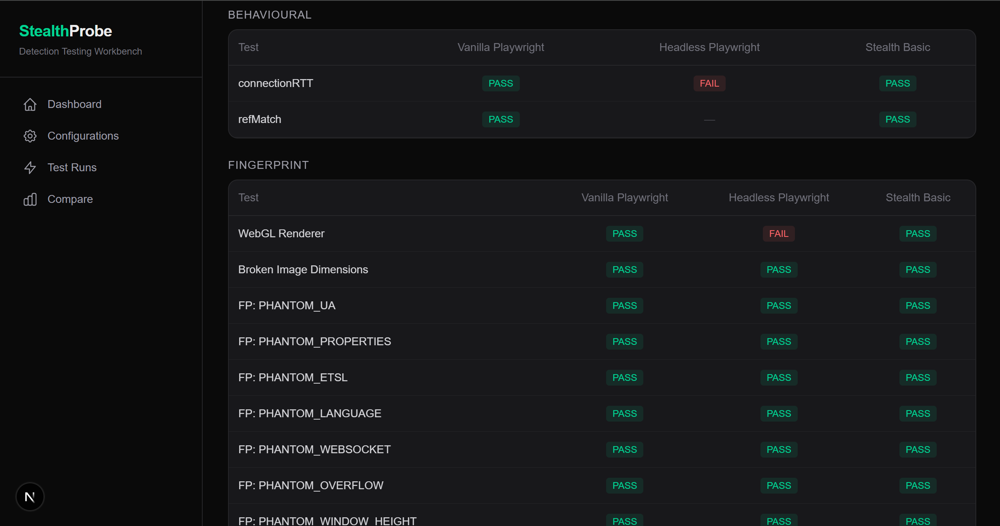
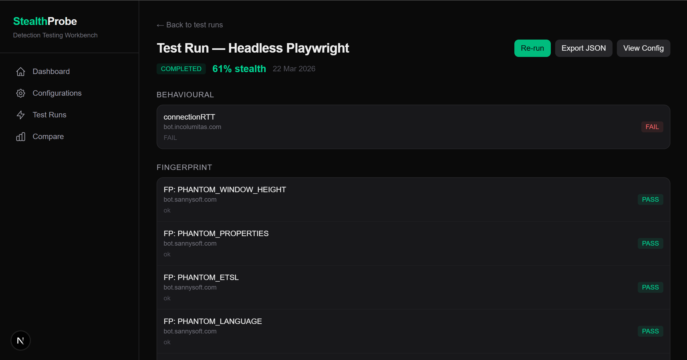

# StealthProbe

A browser automation detection testing workbench. Define browser configurations (vanilla Playwright, stealth mode, custom fingerprints), run them against a battery of bot detection test sites, and get a side-by-side comparison dashboard showing how detectable each setup is.


## Screenshots


*Dashboard with 5 configs tested — average stealth score 86%*


*Side-by-side category breakdown — Headless Playwright drops to 56% on fingerprint tests*


*Per-test PASS/FAIL matrix across 3 configurations*


*Individual run detail with Re-run and Export JSON buttons*

## What It Does

StealthProbe answers the question: **"How detectable is my browser automation setup?"**

1. **Define** browser configurations with Playwright launch args, user agent, viewport, and init scripts
2. **Run** each config against 4 detection test sites simultaneously
3. **Compare** results side-by-side with colour-coded pass/fail breakdowns
4. **Track** improvements over time with historical charts and diff views
5. **Export** results as JSON for further analysis

## Detection Sites Tested

| Site | What It Tests | Scraping Method |
|------|--------------|----------------|
| [bot.sannysoft.com](https://bot.sannysoft.com) | WebDriver flag, plugins, WebGL, broken images, permissions API | HTML table with stable element IDs |
| [bot.incolumitas.com](https://bot.incolumitas.com) | CDP leaks, worker thread consistency, behavioural scoring | JSON blocks (`#new-tests`, `#detection-tests`) |
| [browserscan.net](https://www.browserscan.net/bot-detection) | WebDriver, Selenium, PhantomJS, headless detection, CDP | Text content parsing (obfuscated CSS) |
| [bot-detector.rebrowser.net](https://bot-detector.rebrowser.net) | Runtime.Enable leak, sourceUrl leak, exposeFunction, init scripts | Table rows with emoji indicators |

## Key Features

- **Browser Config CRUD** — create, edit, delete Playwright launch configurations with JSON editor
- **Automated Test Runner** — launches Chromium, visits all 4 sites, scrapes 50+ individual detection checks
- **Stealth Score** — percentage of tests passed (0-100%), colour-coded thresholds
- **Side-by-Side Comparison** — select up to 3 runs to compare with per-test PASS/FAIL matrix
- **Category Bar Charts** — visual breakdown by fingerprint, webdriver, javascript, behavioural
- **Historical Line Charts** — track a config's stealth score across multiple runs
- **Diff View** — see exactly which tests improved or regressed between two runs
- **Re-run** — one-click re-test any previous configuration
- **JSON Export** — download full results with config details for external analysis
- **Live Status Polling** — auto-refreshing UI while tests are running

## Pre-Built Configurations

Comes seeded with 5 configurations covering the stealth spectrum:

1. **Vanilla Playwright** — default launch, no modifications (baseline)
2. **Headless Playwright** — headless mode (faster but easier to detect)
3. **Stealth Basic** — common args: `--disable-blink-features=AutomationControlled`, realistic UA
4. **Stealth Advanced** — args + init script spoofing (navigator, WebGL, plugins)
5. **Mobile Emulation** — iPhone 14 device emulation

## Architecture

```
Frontend (Next.js App Router)
    |
    |-- Dashboard --- Stats, recent runs
    |-- Configs ----- CRUD with JSON editor
    |-- Runs -------- Detail view, per-test breakdown
    |-- Compare ----- Side-by-side with Recharts
    |-- History ----- Line charts, diff view
    |
    v
API Routes (Next.js Route Handlers + Server Actions)
    |
    |-- POST /api/runs --------- Trigger a test run
    |-- GET /api/runs/[id] ----- Poll run status
    |-- GET /api/runs/[id]/export - Download JSON
    |
    v
Test Runner (Playwright)
    |
    |-- Launches Chromium with config
    |-- Visits 4 detection sites sequentially
    |-- Scrapes results via page.evaluate()
    |-- Stores results in PostgreSQL
    |
    v
Database (PostgreSQL on Neon via Prisma)
    |
    |-- BrowserConfig -- Saved launch configurations
    |-- TestRun -------- Execution records with stealth scores
    |-- TestResult ----- Individual pass/fail per detection check
```

## Tech Stack

| Layer | Technology | Why |
|-------|-----------|-----|
| Framework | Next.js 16 (App Router) | Server Components, Server Actions, API routes |
| Language | TypeScript | Type safety across browser automation + web app |
| Styling | Tailwind CSS 4 | Dark theme, responsive, utility-first |
| Database | PostgreSQL (Neon) | Serverless Postgres, free tier |
| ORM | Prisma 7 | Type-safe queries, migrations, schema-as-code |
| Browser Automation | Playwright | Chromium control, page.evaluate() for scraping |
| Charts | Recharts | Line charts (history), bar charts (comparison) |
| Containerisation | Docker | Reproducible Playwright + browser environment |

## Getting Started

### Prerequisites

- Node.js 20+
- PostgreSQL database (or [Neon](https://neon.tech) free tier)

### Setup

```bash
# Clone the repo
git clone https://github.com/Bradowen05/stealthprobe.git
cd stealthprobe

# Install dependencies
npm install

# Install Playwright browsers
npx playwright install chromium

# Set up environment
cp .env.example .env
# Edit .env with your DATABASE_URL

# Run migrations and seed data
npx prisma migrate deploy
npx prisma db seed

# Start the dev server
npm run dev
```

Open http://localhost:3000, click into any configuration, and hit **Run Test**.

### Docker

```bash
# Set DATABASE_URL in .env, then:
docker compose up --build
```

## What I Learned Building This

- **How bot detection works** — WebDriver flags, CDP Runtime.Enable leaks, navigator property consistency across worker threads, behavioural analysis
- **Why naive stealth fails** — spoofing navigator in the main thread without matching Web Workers makes you *more* detectable, not less
- **Playwright internals** — browser contexts, page.evaluate() sandboxing, init scripts, headed vs headless differences
- **Full-stack architecture** — Server Components for data fetching, Server Actions for mutations, fire-and-forget background tasks with status polling
- **Data visualisation** — Recharts for interactive charts, side-by-side comparison UX design

## License

MIT
